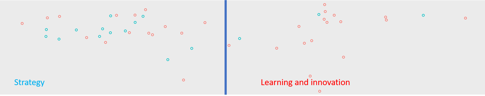
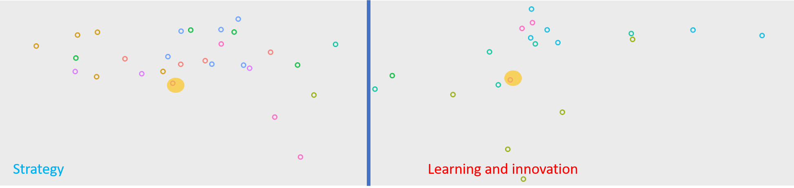
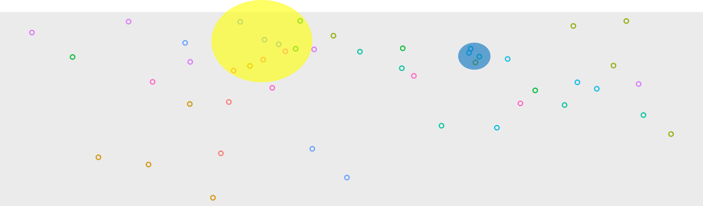
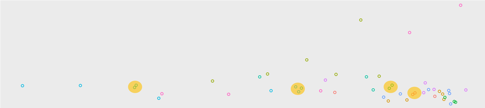

```{r}
#     theme: united
    # highlight: tango
# "default", "cerulean", "journal", "flatly", "darkly", "readable", "spacelab", "united", "cosmo", "lumen", "paper", "sandstone", "simplex", "yeti"
# themes I like: cerulean, flatly, spacelab, 
```


```{r setup, include=FALSE}
knitr::opts_chunk$set(
	echo = FALSE,
	message = FALSE,
	warning = FALSE
)
library(tidyverse)
library(DT)
library(flexdashboard)
library(visNetwork)
library(plotly)
library(tidygraph)
library(shiny)
# edges <- read_rds("CBSEdges.rds")
nodes <- read_rds("CBSNodes.rds") %>% 
  filter(is.na(isTransit)) 
nodesExtend <- read_rds("CBSNodes.rds") %>% 
  filter(isTransit == 1) %>% 
  arrange(-transit) %>% 
  mutate(transitNum = 1:nrow(.),
         type = "no data") %>% 
  filter(transitNum < 11)
dfCourse <- read_rds("CBSCourse.rds")

nodes <- nodes %>% 
  mutate(typeGen = ifelse(str_detect(type, "theoretical"), "Type: theoretical", type),
         typeGen = ifelse(str_detect(typeGen, "meta"), "Type: quantitative", typeGen))

nodes <- nodes %>% 
  mutate(session = as.factor(session))

nodes <- nodes %>% 
  mutate(session = factor(session, c(levels(nodes$session)[-2], levels(nodes$session)[2])))

nodes <- nodes %>% 
  mutate(isStrategy = str_detect(paste(Ti, J.JN), "strateg"))
```

```{r}
# Add description to transitivity improving papers
nodesExtend <- nodesExtend %>%
  mutate(title2 = case_when(
    DN == "A Resource-Based View of the Firm" ~ "Apperently, the earliest paper that explicitly argues for resource-based view of the firm. A very core paper to literature focused on competitive advantage and strategy field as a whole. It is also useful to notice how it helps papers from our 10th session explain how contracts, mergers and alliances affect internal capabilities of the firm.",
    DN == "The social psychology of organizing" ~ "Why isn't this one in our FoM courses? It is a common reference in most of our papers from S6 on organizational learning. Most interestingly, March cites it in his 1990s papers, which means that it somehow complements his Behavioral theory of organization. It might help to read this book to make a connection between OB and strategy literature.",
    DN == "Productivity and the Density of Economic Activity" ~ "Nothing special, this one. Apparently, this is one of the early papers that empirically disentangled advantages from agglomeration and locally available rare resources. This notion is key to the agglomeration papers from the sessions on ecosystem and non-market strategies.",
    DN == "A dynamic model of process and product innovation" ~ "This paper (one of the?) first introduced the relationship between firm's strategy, production process technology, and innovation. A pivotal piece for later research that focused on environmental and procedural limitations and boosts of innovation (sessions on ecosystem strategy, knowledge brokerage, and competitive advantage)",
    DN == "Technological Discontinuities and Organizational Environments" ~ "Just the early contribution by the same authors we had in the course.",
    DN == "The competitive advantage of nations" ~ "Porter's seminal piece that brings the principles of indutry analysis to the national level of analysis. Cathed my eye several times already. Clearly, important to agglomeration and non-market strategy literature."
  ),
  title = paste0(title,  "<br>", "RELATION TO OUR CBS READINGS",  "<br>",
                 title2))
  
```


# Custom Mapping

## Metrics picker {.sidebar}

<font size="4">
**Select mappings**  
By default, the papers are grouped according to how similar their references are and how often they were cited together by future literature. You can switch to coordinates based exclusively on references ("Common references") or future citations ("Future cit."), or based on the number of citations and year.</font>   

```{r}
selectInput(inputId = "metricX", label = h3("X Mapping metric"),
            choices = c("Common References + Future cit." = "xFBCom",
                        "Common references" = "xBCom",
                        "Future cit." = "xFCom",
                        "Year" = "Y",
                        "Number of Citations" = "CC"))

selectInput(inputId = "metricY", label = h3("Y Mapping metric"),
            choices = c("Common References + Future cit." = "yFBCom",
                        "Common references" = "yBCom",
                        "Future cit." = "yFCom",
                        "Year" = "Y",
                        "Number of Citations" = "CC"))

selectInput(inputId = "fill", label = h3("Color"), 
            choices = c("Session" = "session",
                        "Type (general)" = "typeGen",
                        "Type (detailed)" = "type",
                        "Is Strategy?" = "isStrategy"))

```


## Plot {data-width=650}
<font size="4">
**Dynamic customizable visualization**  
X_Y axes and color mappings are customizable. On hovers, you can see the detailed information on each of the papers including top-5 Microsoft Academic topics.</font>  

```{r, } 
renderPlotly({
  g <- nodes %>% 
  ggplot(aes(x =!! rlang::sym(input$metricX), y =!! rlang::sym(input$metricY), 
             text = title,
             fill =!! rlang::sym(input$fill))) +
  geom_jitter(shape = 1, size = 2) +
  theme(legend.position = "right",
        panel.grid = element_blank(),
        axis.title = element_blank(),
        # axis.text = element_blank(),
        # axis.ticks = element_blank()
        # panel.background = element_blank()
        ) 
ggplotly(g, tooltip = c("title"))

})
```
<font size="4">
**Strategy VS Learning and Innovation (static map 1)**  
Based on combined forward and backward literature similarity (the default XY axes). Switch color to "Is Strategy".</font>  

{width=75%}


<font size="4">
To demonstrate utility of this map, I will focus on the general insight that I've already expressed in some of my reaction papers. The sentiment implicit in much strategy literature is not quite compatible with an emphasis on learning and innovation, especially if viewed as processes. You can see this quite clearly in the plot above. Blue nodes are those where term "strateg" is present in title of the paper or the journal. The majority of them is on the left side of the graph, while the right part is mostly free of explicitly "strategy" papers. Most papers on the right are concerned with organizational learning and innovation.  
I guess, that's because capability to change and innovate is much more a function of past operations and position in the field than the result of a few key decisions. To further explore this point, let's first see what sessions locate on which side of the graph. And second, juxtapose papers from a single sessions, one located at on the "learning and innovation" and another on "strategy" sides  

**(Static map 2)**
Based on combined forward and backward literature similarity (the default XY axes). Switch color to "Session" (the default).
</font>  
{width=75%}


<font size="4">
First, notice that all papers from our introductory session are on the left, which confirms my initial interpretation of the plot.  
Then, that most of the papers from our 3rd session on firms as complex adaptive systems are on the right. It supports my perception that adaptation of complex systems is something that just *might happen* to the company. International business papers, on the contrary, belong to the strategy side, because internalization is always a result of a distinct (albeit often endogenous) strategic decision.  
But take even the sessions with papers scattered across the plot. Compare, for instance,  
*Performance Differentials Between Diversifying Entrants and Entrepreneurial start-ups: A Complexity Approach* on the learning and innovation side   
against    
*Diversification, Diseconomies of Scope, and Vertical Contracting: Evidence from the Taxicab Industry* on the strategy side (yellow highlights on the plot above).  
Taxicab companies are free to decide how to organize their business. On the contrary, regardless of the benefits from being a start-up or a diversifying entrant, entering firm cannot change its status. A diversifying company can maybe restrain from entering the market if start-ups are known to have an advantage, but such effects are never that strong. So, this is rather description of an evolutionary process than a strategy advice.  
To summarize, these groupings represent the long-standing dilemma in Organization theory: "Is organizational life determined by intractable environmental constraints, or is it actively created through strategic managerial choices?" (Astley and Van de Ven, 1983; also, Hoskission, 1999)  

Astley, W. Graham, and Andrew H. Van de Ven. 1983. “Central Perspectives and Debates in Organization Theory.” Administrative Science Quarterly 28(2): 245.  
Hoskisson, Robert E, Michael A Hitt, William P Wan, and Daphne Yiu. 1999. “Theory and Research in Strategic Management: Swings of a Pendulum.” JOURNAL OF MANAGEMENT 25(3): 40.

**Similar papers from different sessions**
Another interesting exercise is to look at papers from different sessions which are grouped together on the scatterplot. This means that either they rely on similar literature, or following research tends to combine their findings and arguments. It might be especially insightful to switch to the reference-only axes:  
</font>  

{width=75%}


<font size="4">
For instance, take a look at the papers under the blue highlight. They are from three different sessions, work on very different problems, but clearly rely on quite similar literature.  
The yellow highlight unites papers that deal with international businesses from different angles. A couple recent overviews of strategy field are also in there because international business is an active strand of strategy research.  

Another useful way to look at it is switching to **coordinates based on future citation similarity.**  
</font>  

{width=75%}

<font size="4">
Notice how close together are some of the paper, they are almost twins. This means that each of these groups is primarily cited by a single and strong strand of literature. And most of them are from the same sesions, meaning that the professors also percept these papers as belonging to a single topic of strategy research. For example, if someone investigates organizational reasons why an innovation failed (the leftmost highlight) and cite Fleming (2001), they will probably also cite Chai (2017).  
</font> 

# Citation network

## Network set-up{.sidebar}

```{r}
# sliderInput(inputId = "nAddTrans", label = "Add # more papers to increase transitivity",
#             min = 0, max = 10, value = 0)

checkboxGroupInput("inputDN", label = h3("Add more papers to increase transitivity"), 
                   choices = nodesExtend$DN)
```

## Plot {style = "data-width: 50%;"}   
The graph represents all information on hovers. Everything is draggable and scalable (including the legend). Shape of the node represents the type of the paper.  

```{r}
# renderText({
#   input$inputDN
# })

renderVisNetwork({
  if(length(input$inputDN) > 0){
  tmp <- nodesExtend[nodesExtend$DN %in% input$inputDN,]
  tmp$color <- "black"
  nodes4Net <- bind_rows(tmp, nodes)
  } else{
    nodes4Net <- nodes
  }
  
  nodes4Net <- distinct(nodes4Net, id, .keep_all = T)
  
  edges <- nodes4Net %>%
  select(id, RId) %>%
  unnest_longer(RId) %>%
  distinct(id, RId)

edges4Net <- edges %>%
  filter(RId %in% nodes4Net$id)

edges4Net <- edges4Net %>%
  rename(to = RId, from = id)

dfAssist <- as_tbl_graph(edges4Net) %>%
  to_undirected() %>%
  mutate(community = group_leading_eigen(),
         betweenness = centrality_betweenness(),
         degreeIn = centrality_degree(mode = "out"),
         degreeOut = centrality_degree(mode = "out")) %>%
  as_tibble() %>%
  rename(id = name) %>%
  mutate(id = as.numeric(id))


nodes4Net <- nodes4Net %>%
  left_join(dfAssist, by = "id")


dfAssist <- nodes4Net %>% 
  count(typeGen) %>% 
  mutate(shape = c("square", "triangle", "box", "circle", "star",
                   "ellipse", "diamond")[1:n_distinct(typeGen)])

nodes4Net <- nodes4Net %>% 
  left_join(dfAssist, by = "typeGen")

lgd1 <- distinct(nodes4Net, shape, label = type) %>% 
  mutate(label = str_remove(label, "Type: "))
lgd2 <- distinct(nodes4Net, color, label = session)
lgd <- bind_rows(lgd1, lgd2)

visNetwork(nodes4Net, edges4Net) %>%
  visNodes(scaling = list(label = list(enabled = T)),
           mass = 1) %>%
  visEdges(smooth = F, arrows = "to") %>%
  visPhysics(stabilization = F) %>%
  visLayout(randomSeed = 12) %>%
  visLegend(addNodes = lgd1, useGroups = F, width = 0.2, position = "right", main = "Type") %>% 
  visOptions(highlightNearest = list(enabled = TRUE, algorithm = "hierarchical"))%>%
  visIgraphLayout(layout = "layout_nicely")

})

```
<font size="4">
**Transitivity-improving papers added to the graph**  
I have noticed that in most sessions we were not assigned very seminal papers in the field. This feature aims at locating such papers. Check the boxes in the sidebar to add them to the graph and see details in the table below. These are the papers that, if added to the graph, best improve its overall transitivity. On some of their hovers, you can read my reflections on how they relate and connect the course's readings. Also, this is a way to show theoretical backround of the studied literature, which is one of requirements for the mindmap.  </font>     
*For details, see Implementation section in the Notes tab.*

```{r}
renderDT({
  nodesExtend[nodesExtend$DN %in% input$inputDN,] %>% 
    select(DN, author_1, author_2, Y, J.JN, CC)
})
```


# Notes  
<font size="4">
**Motivation**  
*I choose this form for the mindmap assignment because I wanted to:*  

1. Automatically obtain readily available information: publication year, citations, authors, journal;  
2. Effortlessly import all information on the papers I've previously added to Zotero (e.g., methodology used, custom topics, notes);  
3. Avoid exposing my awful sense of aesthetics by trying to manually draw and chart things (although the design of the app is also showing, I'm afraid);  
4. Obtain coordinates for the papers based on some objective metric of their relationships and build my mindmaps on that;  
5. Get an insight on what to read next;  
6. Being able to compactly represent all this and conveniently share it;    
7. Have a framework that will do the same thing for other sets of literature at zero additional efforts.  

**Implementation**  
*This app is implemented in R. Here is the list of key technologies it relies on:*  

1. Zotero reference manager.  
2. Microsoft Academic Knowledge Graph API. Google Scholar doesn't have any convenient way to access its data. Microsoft is unlimited and open access, allows complex queries. All additional information on the papers obtained from there;   
3. Igraph package to calculate network metrics;  
4. Viznetwork package for interactive visualization of network data (tab2 - Citation network);  
5. MDS package for multidimensional scaling. This allowed me to map similarity matrix of the papers onto X_Y plane;  
6. Plotly for interactively plotting the non-network data (tab1 - custom mapping);  
7. Shiny and FlexDashboard to design and deploy the web-application.  

*This is the pipeline to get from course syllabus to the app:*  

1. Import CBS literature to Zotero and create bibliography items for each paper;    
2. Manually add tags that mark the CBS course, session, and type of the paper;  
3. Export the whole library in .csv file into R and filter only the CBS papers;   
4. Request information on the course papers from Microsoft Academic (MA);  
5. From MA, request information on the papers that were referenced by the course papers and the papers that cited them;
6. Calculate reference and future citations similarity scores. For instance, if paper A referenced half of the papers that were referenced by paper B, their reference similarity will be 0.5. If these two papers were cited together in 20 future papers, while paper A has 100 citations and paper B 100+ citations, then their future citation similarity score = 20/100 = 0.2. This is the tricitation score implemented from (McCain, 2009)* Their overall similarity score (the default on tab1) will be (0.2+0.5)/2 = 0.35. Performing this operation for all pairs of the papers yielded 3 citation similarity matrices;  
7. On each citation similarity matrix, perform multidimensional scaling, transforming similarity score into coordinates on XY plane. Similar papers will be mapped close together. This resulted in 3 sets of XY coordinates to choose from in the first tab;  
8. The data for citation similarity contained subset of cross references between the course literature to create the citation graph on tab2;  
9. To locate theoretical background of the papers, I first considered just taking the most commonly cited classics in the course paper. But this would be boring. I would probably just get the most commonly cited papers in OT, and this you can do in Microsoft Academic interface. Instead, I iteratively added to the citation graph each paper that was at least twice cited by the course's papers and measured how this improves transitivity of the graph. The top 10 papers seem relevant. Some of them are pivotal for strategy as a discipline and unite multiple papers in the course. Others are only important for small subsets of papers. My comments on that are available on hovers in tab2 after adding the transitivity-improving papers to the graph.    
10. Deploy the results as a web application.  

*McCain, Katherine W. 2009. “Using Tricitation to Dissect the Citation Image: Conrad Hal Waddington and the Rise of Evolutionary Developmental Biology.” Journal of the American Society for Information Science and Technology 60(7): 1301–19.  


**Plans for improvement**  
*These are just things that can be done better with more efforts than I could afford right now. Most of them I'm going to implement for future personal use.*

1. On tab2, fix node coordinates to original values, so that the papers stay in place when adding transitivity-improving papers. A mindmap shouldn't be too fluid;
2. Add hovers on reference links at tab2. This can be done manually (but this is too much work), or automatically (parsing the pdf's and taking taking the sentences with the cite to hover. But this would be quite challenging too). Now that I think about it, this could be a useful collaborative exercise for a group of PhD students;  
3. To tab1, add mapping based on abstract similarity (based on topic modelling, maybe with embeddings);
4. Tie choices of XY axes in tab1 to only appropriate combinations (e.g., x = future citations & y = common references - makes no sense);  
5. To tab2, I could do the same transitivity search for future works. I.e., what papers, if added to the graph of the literature, will most improve its transitivity  
6. Instead of multidimensional scaling, I am going to try correspondence analysis for tab1. I believe it can provide more meaningful interpretation of the dimension space.
7. It is also feasible to allow a user to upload personal zotero library in the interface and get the same analysis for this. But for my personal use, I'm satisfied with doing it with code as it takes only a couple of minutes.

The code is available at my GitHub: https://github.com/alexvit/CBSLitMap.git 
</font>  


